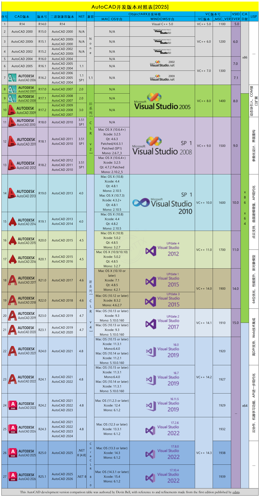
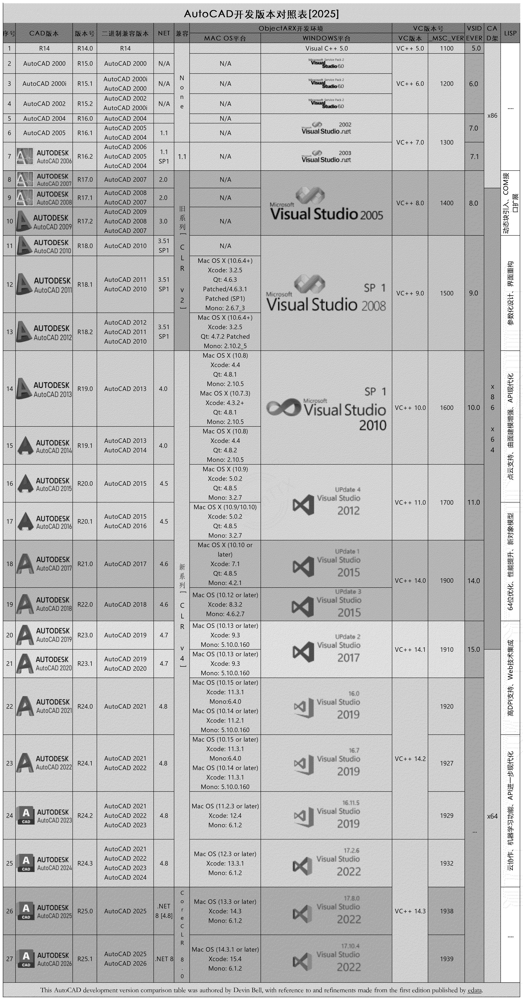

# ObjectARX SDK - AutoCAD 二次开发支持库

> AutoCAD ObjectARX 软件开发工具包完整集合（R14-2026，包含所有版本）

---

## 📖 简介

本仓库包含 **AutoCAD ObjectARX 软件开发工具包（SDK）** 的完整版本集合，涵盖从 **AutoCAD R14 (1998)** 到 **AutoCAD 2026 (R25.1)** 的所有主要版本。

**ObjectARX** 是 Autodesk 提供的用于 AutoCAD 二次开发的 C++ 和 .NET API，允许开发者创建功能强大的 AutoCAD 应用程序和插件。

---

## 🗂️ 版本列表

本仓库包含以下 **26 个版本** 的 ObjectARX SDK：

| AutoCAD 版本 | ObjectARX 版本 | 目录名称/文件 | 状态 |
|------------|--------------|-------------|------|
| AutoCAD R14 (1998) | R14 | `R14.exe` (安装包) | ✅ |
| AutoCAD 2000 | R15.0 | `2000-R15.0` | ✅ |
| AutoCAD 2000i | R15.1 | `2000i-R15.1` | ✅ |
| AutoCAD 2002 | R15.2 | `2002-R15.2` | ✅ |
| AutoCAD 2004 | R16.0 | `2004-R16.0` | ✅ |
| AutoCAD 2005 | R16.1 | `2005-R16.1` | ✅ |
| AutoCAD 2006 | R16.2 | `2006-R16.2` | ✅ |
| AutoCAD 2007 | R17.0 | `2007-R17.0` | ✅ |
| AutoCAD 2008 | R17.1 | `2008-R17.1` | ✅ |
| AutoCAD 2009 | R17.2 | `2009-R17.2` | ✅ |
| AutoCAD 2010 | R18.0 | `2010-R18.0` | ✅ |
| AutoCAD 2011 | R18.1 | `2011-R18.1` | ✅ |
| AutoCAD 2012 | R18.2 | `2012-R18.2` | ✅ |
| AutoCAD 2013 | R19.0 | `2013-R19.0` | ✅ |
| AutoCAD 2014 | R19.1 | `2014-R19.1` | ✅ |
| AutoCAD 2015 | R20.0 | `2015-R20.0` | ✅ |
| AutoCAD 2016 | R20.1 | `2016-R20.1` | ✅ |
| AutoCAD 2017 | R21.0 | `2017-R21.0` | ✅ |
| AutoCAD 2018 | R22.0 | `2018-R22.0` | ✅ |
| AutoCAD 2019 | R23.0 | `2019-R23.0` | ✅ |
| AutoCAD 2020 | R23.1 | `2020-R23.1` | ✅ |
| AutoCAD 2021 | R24.0 | `2021-R24.0` | ✅ |
| AutoCAD 2022 | R24.1 | `2022-R24.1` | ✅ |
| AutoCAD 2023 | R24.2 | `2023-R24.2` | ✅ |
| AutoCAD 2024 | R24.3 | `2024-R24.3` | ✅ |
| AutoCAD 2025 | R25.0 | `2025-R25.0` | ✅ |
| AutoCAD 2026 | R25.1 | `2026-R25.1` | ✅ |

> **提示**: 
> - **R14 (1998)**: 以 `R14.exe` 安装包形式提供，使用 Visual C++ 5.0 开发
> - 版本对照表图片已移至文档末尾，详细描述了每个版本的开发环境要求

---

## 📁 目录结构

每个版本目录通常包含以下标准结构：

```
<版本目录>/
├── inc/              # 头文件目录（32位）
├── inc-x64/          # 头文件目录（64位）
├── inc-win32/        # Windows 32位特定头文件
├── lib/              # 库文件目录（32位，旧版本）
├── lib-x64/          # 库文件目录（64位，新版本）
├── docs/             # 文档目录（CHM、PDF等）
├── samples/          # 示例代码
│   ├── database/     # 数据库操作示例
│   ├── entity/       # 实体对象示例
│   ├── editor/       # 编辑器示例
│   ├── graphics/     # 图形处理示例
│   ├── reactors/     # 反应器示例
│   ├── com/          # COM 接口示例
│   ├── dotNet/       # .NET API 示例
│   └── misc/         # 其他示例
├── utils/            # 工具和实用程序
│   ├── amodeler/     # 高级建模工具
│   ├── brep/         # 边界表示法工具
│   ├── HlrApi/       # 隐藏线移除 API
│   └── Atil/         # AutoCAD 纹理图像库
└── classmap/         # 类映射文件（DWG格式）
```

---

## 🚀 快速开始

### 系统要求

- **操作系统**: Windows (通常支持 Windows 7 及以上版本)
- **开发环境**: 
  - Visual Studio（建议使用与 AutoCAD 版本匹配的 VS 版本）
  - 部分旧版本可能需要 Visual C++ 6.0
- **AutoCAD**: 需要安装对应版本的 AutoCAD 软件

### 编译示例

#### 1. 选择对应版本目录

```bash
cd 2025-R25.0
```

#### 2. 打开示例项目

找到 `samples` 目录下的示例项目，使用 Visual Studio 打开 `.sln` 或 `.vcxproj` 文件。

#### 3. 配置项目设置

在 Visual Studio 项目属性中配置：

**C/C++ → 常规 → 附加包含目录:**
```
$(OBJECTARX_SDK_PATH)\inc-x64
$(OBJECTARX_SDK_PATH)\inc
```

**链接器 → 常规 → 附加库目录:**
```
$(OBJECTARX_SDK_PATH)\lib-x64
```

**链接器 → 输入 → 附加依赖项:**
```
rxapi.lib
acdb25.lib
acge25.lib
acgi25.lib
...
```

#### 4. 编译和运行

- 编译项目生成 `.arx` 或 `.dll` 文件
- 在 AutoCAD 中使用 `NETLOAD` 或 `APPLOAD` 命令加载插件

---

## 📚 主要内容

### 1. 头文件 (Header Files)

每个版本都包含完整的头文件集合：
- **核心 API**: `rxapi.h`, `rxdefs.h` 等
- **数据库 API**: `acdb.h`, `dbents.h` 等
- **几何 API**: `acge.h`, `geassign.h` 等
- **用户界面 API**: `acui.h`, `adui.h` 等

### 2. 库文件 (Library Files)

预编译的静态库文件，包含：
- `rxapi.lib` - ObjectARX 运行时 API
- `acdb*.lib` - 数据库 API
- `acge*.lib` - 几何库
- `acgi*.lib` - 图形接口库
- 以及其他相关库文件

### 3. 示例代码 (Samples)

丰富的示例代码涵盖各种开发场景：

#### 数据库操作 (`database/`)
- ARXDBG - 调试工具示例
- 实体遍历、事务处理
- XData、XRecord 操作
- 克隆和深拷贝

#### 自定义实体 (`entity/`)
- PolySamp - 多边形实体示例
- 自定义对象创建
- 实体属性扩展

#### 用户界面 (`editor/`)
- MFC 对话框示例
- 工具面板示例
- 上下文菜单

#### 图形处理 (`graphics/`)
- 视觉样式
- 材质和渲染
- 坐标系统

#### 反应器 (`reactors/`)
- 数据库反应器
- 编辑器反应器
- 协议反应器

#### .NET API (`dotNet/`)
- C# 和 VB.NET 示例
- 事件处理
- UI 扩展

### 4. 文档 (Documentation)

文档通常以 CHM（帮助文件）或 PDF 格式提供：
- `arxdev.chm` - 开发指南
- `arxref.chm` - API 参考
- `arxmgd.chm` - .NET API 文档
- `readarx.chm` - 入门教程

### 5. 工具和实用程序 (Utilities)

- **AModeler**: 高级建模工具库
- **BRep**: 边界表示法几何库
- **HlrApi**: 隐藏线移除功能
- **Atil**: 纹理图像处理库

---

## 🔧 开发指南

### ObjectARX vs .NET API

<table>
<tr>
<td width="50%">

#### ObjectARX (C++)

- ✅ 性能最优，功能最全面
- ✅ 适合复杂的底层操作
- ⚠️ 需要 C++ 开发经验

</td>
<td width="50%">

#### .NET API (C#/VB.NET)

- ✅ 开发效率高，语法简洁
- ✅ 适合快速开发 UI 和业务逻辑
- ⚠️ 性能略低于 ObjectARX

</td>
</tr>
</table>

### 版本兼容性

⚠️ **重要提示**: ObjectARX 应用程序必须与 AutoCAD 版本严格匹配。

- AutoCAD 2025 的插件只能在 AutoCAD 2025 上运行
- 旧版本插件无法在新版本 AutoCAD 上运行
- 需要为每个目标 AutoCAD 版本单独编译

### 调试技巧

1. 使用 `ARXDBG` 示例工具进行调试
2. 在 Visual Studio 中附加到 AutoCAD 进程进行调试
3. 使用 `acutPrintf` 或 `.NET` 的 `System.Diagnostics.Debug` 输出调试信息

---

## ⚠️ 注意事项

### 许可证
ObjectARX SDK 受 Autodesk 许可协议约束，请遵守相关使用条款。

### 版本匹配
确保 SDK 版本与目标 AutoCAD 版本完全匹配。

### R14 版本
`R14.exe` 是 AutoCAD R14 (1998) 版本的 SDK 安装包，由于文件格式较老，可能需要：
- 在兼容模式下运行（Windows 兼容性设置）
- 使用旧版本 Windows 系统（如 Windows XP/7）解压
- 或者使用专门的解压工具

### 平台支持

| 版本范围 | 平台支持 |
|---------|---------|
| AutoCAD 2008-2019 | 同时支持 32 位和 64 位平台（64 位为主流） |
| **AutoCAD 2020 及以后** | **仅支持 64 位平台，结束对 32 位（X86）的支持** |

### Visual Studio 版本要求

不同 AutoCAD 版本需要特定版本的 Visual Studio：

| AutoCAD 版本 | Visual Studio 版本 |
|------------|------------------|
| AutoCAD R14 | Visual C++ 5.0 |
| AutoCAD 2000-2004 | Visual C++ 6.0 或 Visual Studio .NET |
| AutoCAD 2005-2006 | Visual Studio .NET 2002/2003 |
| AutoCAD 2007-2009 | Visual Studio 2005 |
| AutoCAD 2010-2012 | Visual Studio 2008 |
| AutoCAD 2013-2014 | Visual Studio 2010 |
| AutoCAD 2015-2016 | Visual Studio 2012 |
| AutoCAD 2017-2019 | Visual Studio 2015 |
| AutoCAD 2020-2021 | Visual Studio 2017 |
| AutoCAD 2022-2023 | Visual Studio 2019 |
| AutoCAD 2024-2025 | Visual Studio 2022 |
| AutoCAD 2026 | Visual Studio 2022 |

> 💡 详细说明请参考文档末尾的版本对照表图片。

---

## 📖 资源链接

### 官方资源
- [Autodesk ObjectARX 官方网站](https://www.autodesk.com/developer-network/platform-technologies/autocad/arx)
- [AutoCAD 开发者中心](https://www.autodesk.com/developer-network/platform-technologies/autocad)

### 社区论坛
- [明经通道 CAD 社区](http://www.mjtd.com/) - 中国领先的 CAD 二次开发社区，开发讨论氛围活跃，提供大量技术资料和代码示例
  - [维护者个人空间](http://www.mjtd.com/?7318880) - 在明经通道的个人主页
- [Autodesk 开发者论坛](https://forums.autodesk.com/) - Autodesk 官方开发者社区

### 学习资源
- ObjectARX 开发文档（位于各版本的 `docs/` 目录）
- 示例代码（位于各版本的 `samples/` 目录）
- ARXLabs（早期版本提供的教程）

---

## 📞 支持

如有问题，请：

1. 查阅对应版本的文档（`docs/` 目录）
2. 参考示例代码（`samples/` 目录）
3. 访问 [明经通道 CAD 社区](http://www.mjtd.com/) - 中文社区，讨论氛围活跃
4. 访问 [Autodesk 开发者论坛](https://forums.autodesk.com/) - 官方英文社区
5. 通过 [Telegram](https://t.me/DevinITX) 联系维护者

---

## 🤝 贡献

如果您发现任何问题或有改进建议，欢迎提交 **Issue** 或 **Pull Request**。

### 维护者

- **明经通道**: [Hexon](http://www.mjtd.com/?7318880) - 个人空间
- **Linux do**: [Hexon-X](https://linux.do/) - 用户名 Hexon-X
- **Telegram**: [@DevinITX](https://t.me/DevinITX)

---

## 📄 许可证

本仓库仅用于学习和开发目的。ObjectARX SDK 的版权归 Autodesk 所有。使用本 SDK 进行开发时，请遵守 Autodesk 的相关许可协议。

---

## 📋 AutoCAD 版本对照表

以下图片详细描述了每个 AutoCAD 版本的开发环境要求（Visual Studio 版本、编译器版本、平台支持等）。

### 彩色版本



### 黑白版本



> 💡 **建议**: 查阅这些图片文件获取准确的版本对应关系和开发环境要求信息。

---

<div align="center">

**最后更新**: 2025年 | **维护状态**: 持续更新中

**维护者联系方式**:
- [Telegram @DevinITX](https://t.me/DevinITX)
- [明经通道个人空间](http://www.mjtd.com/?7318880)
- Linux do: [Hexon-X](https://linux.do/)

</div>
